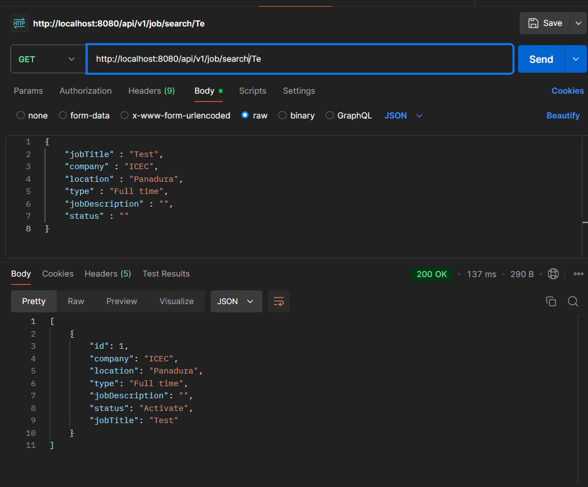
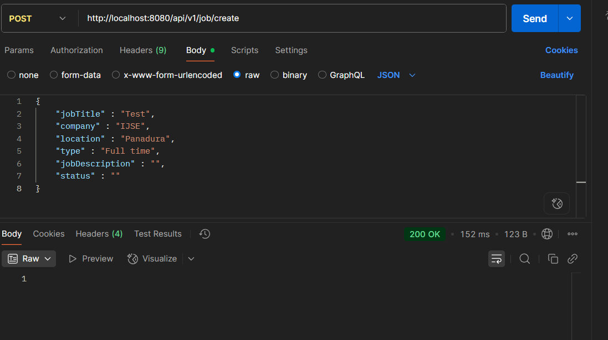
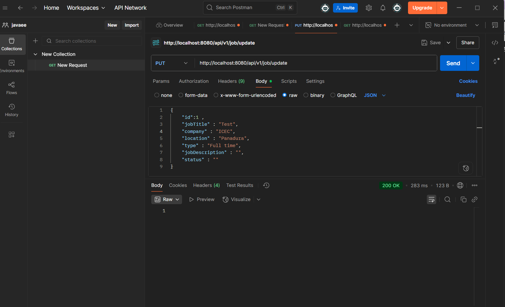

## Project Screenshots

Here are some key functionalities demonstrated through screenshots:

### 🔍 Keyword Search Method

This shows how the keyword-based search method works in the system.

---

### 💾 Save Function

This screenshot represents the save operation functionality.

---

### 📋 Get All Function

This image shows how all data is fetched using the "get all" method.

---

### ✏️ Update Function

This demonstrates how the update feature works within the system.
